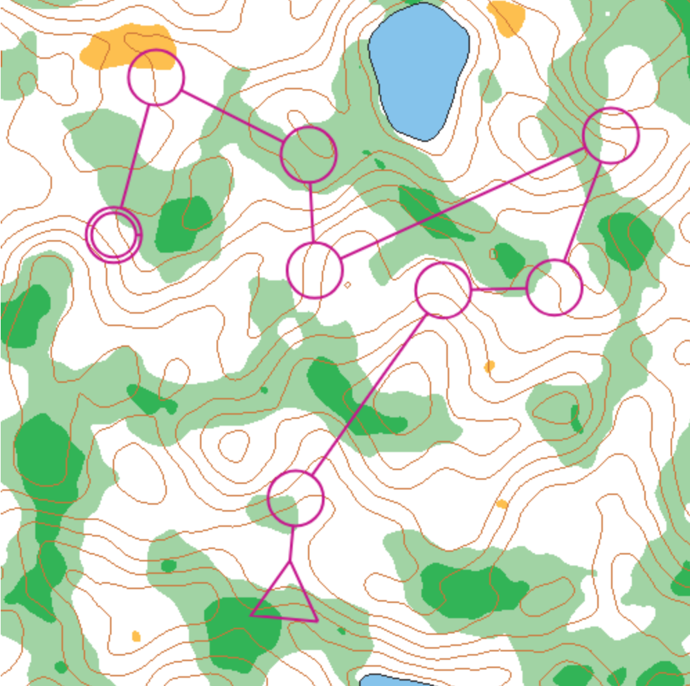
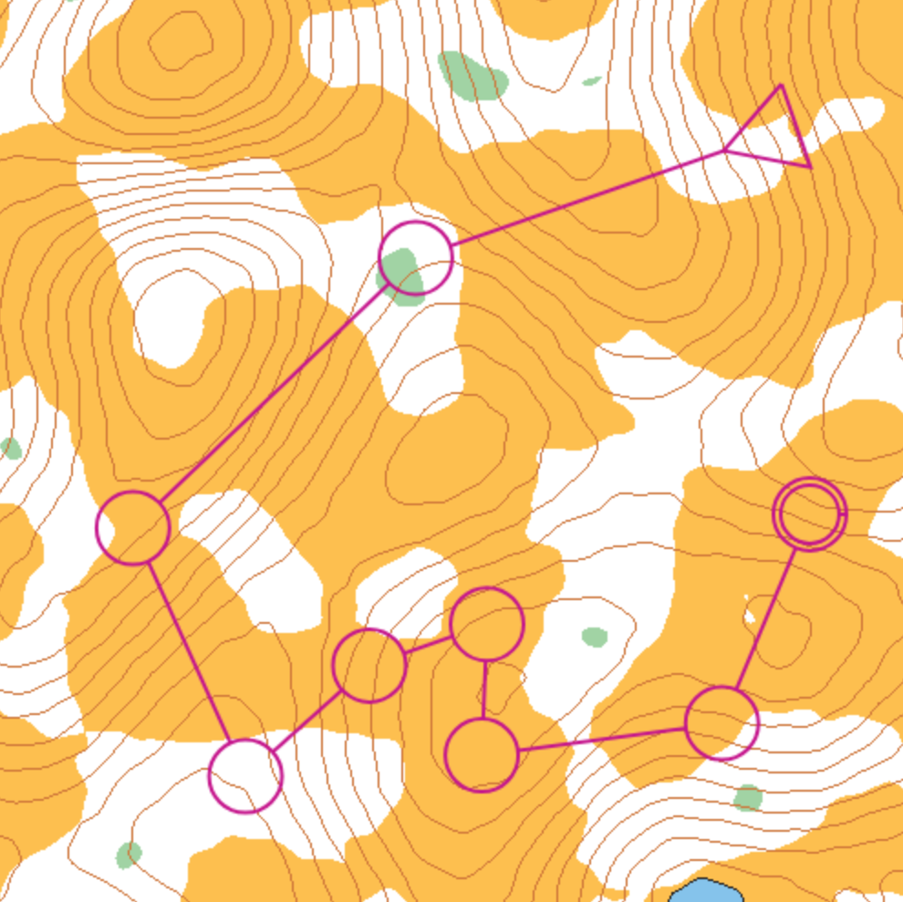

# MapMixer

MapMixer is a randomized orienteering map generator aimed at helping orienteers improve their route choice skills. I developed it in 2021 for my high school's digital technologies class. Check it out at [map-mixer.web.app](https://map-mixer.web.app).

## Features

- Randomized contour and vegetation generation
- Choose between forest or farmland terrain
- Option to include a course of controls overlayed on the map

## How it Works

MapMixer is built using plain Javascript and HTML Canvas.
Contours and vegetation levels are generated with Perlin Noise.
To overlay realistic courses, controls are first placed at random points, then refactored using the 2-opt method to eliminate any crossing paths.

## Screenshots

## License

MapMixer is released under the MIT License. See the [LICENSE](LICENSE) file for more information.
